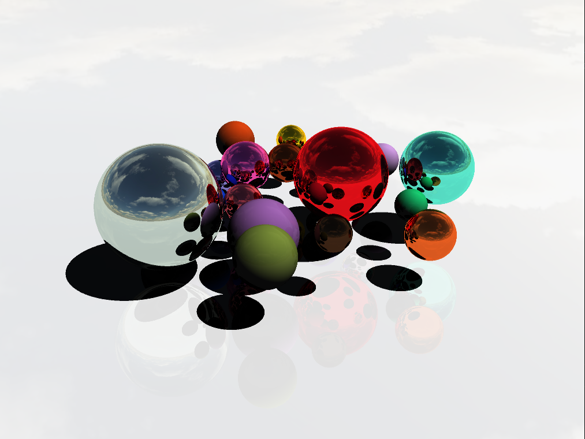

## Description

Ce projet est un démonstrateur de lancer de rayons en temps réel implémenté avec Vulkan. Il met en œuvre les Acceleration Structures (BLAS/TLAS) et une pipeline graphique pour afficher le rendu final.

## Fonctionnalités

* Construction et gestion des Acceleration Structures (BLAS et TLAS).
* Affichage plein écran du résultat via un pipeline graphique classique.
* Gestion de la caméra FPS (clavier + souris).
* Chargement d'une skybox (format cubemap).
* Synchronisation via sémaphores et fences.

## Prérequis

* Vulkan SDK (>= 1.3)
* CMake (>= 3.5)
* GLFW (>= 3.3)
* GLM

## Installation et compilation

```bash
# À la racine du projet
mkdir build && cd build
cmake ..
```

## Exécution

```bash
# Depuis le dossier build
./vulkan_ray_tracer
```

## Screenshot



## TODO List

* [x] Ray tracing basique d'une Sphére 
* [x] Compléter le chargement de la skybox en tant que cubemap
* [x] Ombarge de la sphére
* [x] Lumière spéculaire et réflectivité
* [ ] Ray tracing sur n'importe quel maillage
* [ ] Ajouter une interface utilisateur (ImGui) pour régler les paramètres au runtime
* [ ] Mettre en place des outils de profilage des performances (temps de build AS, temps de trace)
* [ ] Implémenter un algorithme de débruitage (denoising)
* [ ] Acceleration Structures
